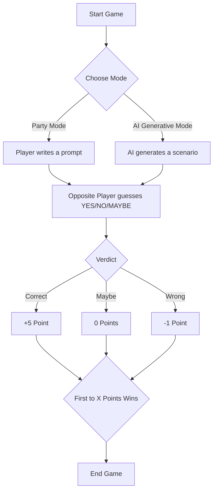

<h1 align="center">Law & Disorder</h1>

<p align="center">
  
</p>

<p align="center">
   
   
   
   </a>
</p>

## Overview
"Law & Disorder" is a party game that allows players to input absurd situations and check their legality according to the Indian Constitution. The game provides a verdict of **YES**, **NO**, or **MAYBE**, along with cited articles and reasoning. Additionally, it offers insights into potential legal loopholes that could be exploited.

## Features
- User-friendly interface for inputting situations.
- AI-powered analysis of legality based on the Indian Constitution.
- Clear presentation of verdicts, relevant articles, and reasoning.
- Suggestions for legal loopholes related to the situation.

## Project Structure
```
legal-game
├── frontend
│   ├── src
│   │   ├── components
│   │   │   └── LegalGame.jsx
│   │   ├── styles
│   │   │   └── globals.css
│   │   └── app.jsx
│   ├── package.json
│   └── index.html
├── backend
│   ├── models.py
│   ├── constitution_analyzer.py
│   ├── main.py
│   ├── requirements.txt
│   └── data
│       └── constitution_of_india.csv
└── README.md
```

## Setup Instructions

### Frontend
1. Navigate to the `frontend` directory.
2. Install dependencies:
   ```
   npm install
   ```
3. Start the development server:
   ```
   npm start
   ```

### Backend
1. Navigate to the `backend` directory.
2. Install dependencies:
   ```
   pip install -r requirements.txt
   ```
3. Start the FastAPI server:
   ```
   python app.py
   ```

## Technologies
- **Frontend**: React JS
- **Backend**: FastAPI, Python
- **AI/ML**: Modified Version of MiniLM-L6 and Google Flan-T5
- **Database**: CSV for storing the Indian Constitution data

## Usage
1. Open the frontend application in your browser.
2. Enter a situation in the input field and submit.
3. View the verdict, relevant articles, reasoning, and potential loopholes.

## How the Game Works


## Contributing
Contributions are welcome! Please submit a pull request or open an issue for any enhancements or bug fixes.

## License
This project is licensed under the Apache 2.0 License.
